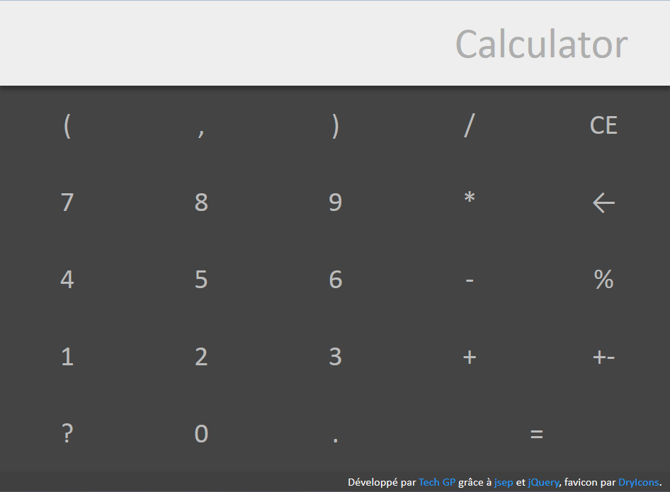
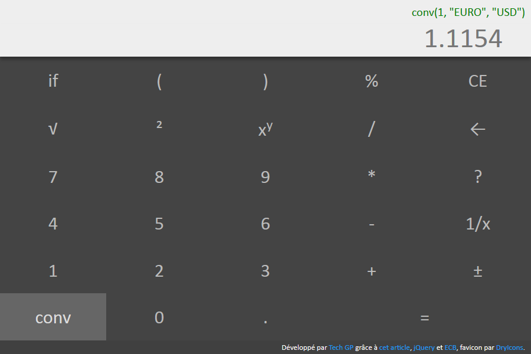
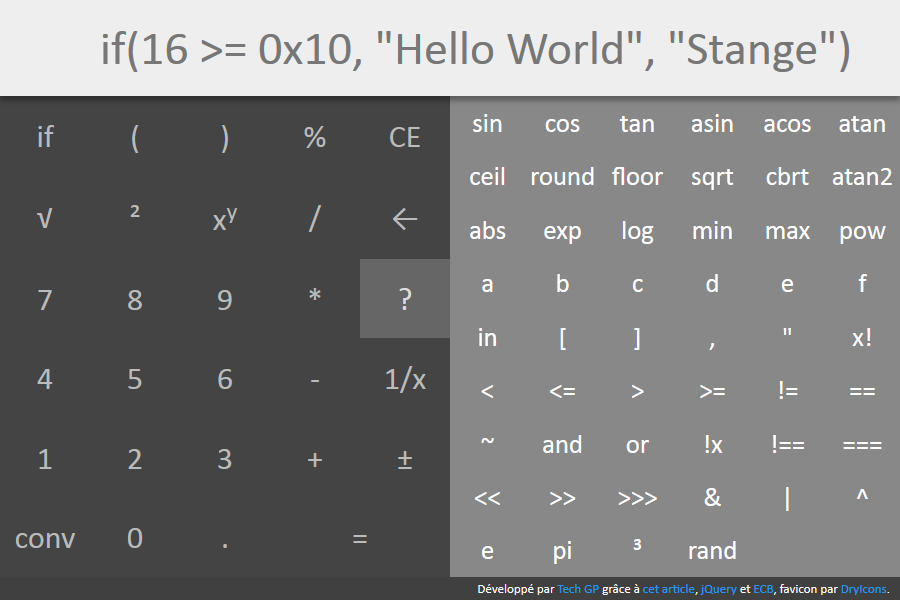

# webapps-calculator

A calculator application with usual mathematical features, extendable function support and unit conversion.

```Example
If((1+Pi == acos(-1) -2 + (1.5+1.5)) == true, "OK", "KO")
```

## Présentation

[Cette application](https://techgp.fr/webapps/webapps-calculator.html) écrite en HTML5, JavaScript et CSS3 vous donnera accès à une calculatrice directement dans votre navigateur.

Les liens suivants ont été utiles pour cette application :

- [Parsing Expressions by Recursive Descent](http://www.engr.mun.ca/~theo/Misc/exp_parsing.htm), un formidable article qui propose une méthode simple à implémenter pour créer un parseur... et qui a mené à l'écriture du parseur utilisé ici.
- [jsep](http://jsep.from.so/), pour JavaScript Expression Parser, sous licence MIT, qui été utilisé jusqu'au 22/05/2016 pour l'analyse des formules. L'API comme le code sont simples à comprendre.
- [jQuery 3.3.1](https://jquery.com/) sous licence MIT
- [moment.js 2.22.2](https://momentjs.com/) sous licence MIT
- [ECB](http://www.ecb.europa.eu/stats/exchange/eurofxref/html/index.en.html) qui utilisé dans le convertisseur monétaire pour obtenir des taux de change quotidien
- [DryIcons](https://dryicons.com/) pour le favicon

L'application devrait fonctionner correctement en mode déconnecté grâce aux **Service Workers** intégrés aux navigateurs modernes : d'abord Chrome+Opera+Firefox puis récemment Safari+Edge ([détail ici](https://caniuse.com/#search=service+worker) ).

Plus d'infos sur les Services Workers chez [Google](https://developers.google.com/web/fundamentals/primers/service-workers/) ou [Mozilla](https://developer.mozilla.org/en-US/docs/Web/API/Service_Worker_API/Using_Service_Workers).

## Captures d'écran

### Présentation de l'IHM



### Utilisation du convertisseur (monétaire par l'exemple)



### Accès aux fonctions avancées



## Liens autres

- [Conversion d'unités sur Wikipedia FR](https://fr.wikipedia.org/wiki/Conversion_des_unit%C3%A9s), qui a aidé à alimenter les unités utilisées par la fonction de conversion
- [Documentation de Math chez Mozilla](https://developer.mozilla.org/en-US/docs/Web/JavaScript/Reference/Global_Objects/Math), avec polyfill pour sinh, cosh, tanh, asinh, acosh, atanh, hypot, log2, log10, log1p, imul, clz32
- Recherche : http://stackoverflow.com/questions/1823612/lexer-written-in-javascript
- Recherche : http://stackoverflow.com/questions/1052470/javascript-parser-for-simple-expression
- Math.js, plus lourd que "jsep" et plus limité aux math : http://mathjs.org/download.html
- PEG.js; pour se construire des parseurs à partir de la syntaxe : http://pegjs.org/
- Tutoriel : [partie 1](http://ariya.ofilabs.com/2011/08/math-evaluator-in-javascript-part1.html), [partie 2](http://ariya.ofilabs.com/2011/08/math-evaluator-in-javascript-part-2.html) et [partie 3](http://ariya.ofilabs.com/2011/08/math-expression-evaluator-in-javascript-part-3.html)

## Licence

Ce projet est distribué sous licence MIT, reproduite dans le fichier LICENSE ici présent.

## Changelog

2016-04-25
- première version

2016-04-26
- function names and operators are case-insensitive
- press enter while input has focus to calculate
- reset success/error status when formula is cleared

2016-05-06
- correction de la precedence des opérateurs
- ajout du support multilingue, détecté par "navigator.language"
- ajout de la conversion d'unité, par exemple convert(2, "km", "m") = 1000
- ajout de la conversion monétaires, par exemple convert(2, "€", "$"), grâce à ECB
- ajout de l'opérateur "in" qui met en évidence le support des tableaux
- description math.js et PEG.js

2016-05-09
- ajout des rubriques "Accélération", "Force", "Pression", "Puissance", "Vitesse" et mise à jour de certaines autres rubriques
- renvoi vers la page Wikipedia des conversions en ne précisant que l'unité (par exemple convertir("radian"))
- ajout de noms secondaires pour les unités (par exemple masse atomique = dalton = Da = u = uma)
- intégration d'une [pull request](soney/jsep#23) pour personnaliser les "literals" (pi par exemple)
- intégration d'une [pull request](soney/jsep#27) pour corriger les opérateurs unaires
- intégration d'une [pull request](soney/jsep#17) pour permettre de saisir des nombres en héxadécimal (0x12 par exemple)
- sur le même principe, permettre de saisir des nombres en binaire (0b1100 = 12 par exemple) ou en octal (0o12 = 10 par exemple)

2016-05-22
- mise à jour de jquery 2.2.2 en 2.2.4
- mettre en cache dans localStorage les taux de change (pour le mode déconnecté)

2016-05-29
- remplacement de [JSEP](http://jsep.from.so/) par un parseur fait maison, construit après lecture de l'article [Parsing Expressions by Recursive Descent](http://www.engr.mun.ca/~theo/Misc/exp_parsing.htm)

2016-05-30
- restaurer le support des chaînes de caractères (cf Literal et next())
- corriger l'affichage du résultat si "false" (n'affiche rien pour le moment)
- terminer la traduction de "calculator.js" en anglais
- amélioration de "calculator.format" pour que les littéraux reprennent la valeur saisie telle quelle

2016-06-04
- correction d'un bug sur l'évaluation de littéraux que Javascript assimile à faux (le nombre 0, le texte vide)
- homogénéisation du clavier de la calculatrice avec les opérateurs et fonctions du calculateur
- ajout de "1/x" (inverse), "e" (Euler's number), "³" (cubic), "cbrt" (cubic root), "!" (factorielle) et "atan2" (atan2(x, y) = atan(x/y))

2016-06-28
- ajout du fichier LICENCE

2016-06-30
- amélioration de la gestion des erreurs : traduction des messages et remontée de la position
- correction d'un bug pour ne pas planter lorsque localStorage n'est pas défini

2016-07-02
- laisser à l'utilisateur le choix de l'URL utilisée pour les taux de change

2017-05-01
- utilisation de Promise pour les calculs afin de permettre l'intégration de fonctions asynchrones, comme par exemple pour la conversion monétaire
- réorganisation du code pour la fonction de conversion, notamment pour la partie concernant les conversions monétaires
- suppression des liens vers Wikipédia (fonction obscure et en plus vers Wikipédia FR uniquement)

2017-05-04
- ajout du support des dates et/ou des heures (nécessite "moment.js")
- réécriture de l'interprétation des littéraux (suite à l'ajout des dates/heures)
- correction de la gestion des paramètres optionnels "undefined" dans "eval" et "evalAll"
- correction de la traduction des opérateurs car ce sont des mots réservés de la syntaxe

2017-05-06
- ajout du support des tableaux vides
- ajout du support des fonctions sans paramètre
- correction de la mise en cache cassée suite à l'ajout de "moment"
- mise à jour des screenshots

2017-05-08
- inversion de la déclaration des opérateurs dans "addDefaultOperators" pour éviter la valeur de "precedence" en dur
- correction de typo

2017-05-09
- suppression des Promise (introduites le 01/05) au profit de callback pour les 2 raisons suivantes :
1. les Promise ne sont pas supportées par IE
2. les Promise ne sont pas synchrones, même si tout le contenu de la formule est synchrone
- personnalisation possible des formats de dates et heures de Calculator via "dateFormat", "timeFormat" et "datetimeFormat"
- optimisation des opérateurs && et || pour s'arrêter dès que possible (un "false" pour && ou un "true" pour ||)

2017-05-19
- ajout du support des variables (en fait des littéraux donc "value" est accessible via getter / setter au lieu d'une valeur fixe)
- ajout d'une variable "mem" pour conserver (via "MS") ou récupérer (via "MR") une valeur en mémoire dans la calculatrice
- correction des opérateurs "=" (affectation), "++" et "--" (postfix ou prefix) qui manipulent des variables
- support de la flèche vers le haut pour éditer la formule précédemment calculée

2017-05-21
- mise à jour de jQuery (2.2.4 en 3.2.1) et moment.js (2.15.0 en 2.18.1)

2017-05-30
- création des méthodes addLiteralEntry, addFunctionEntry et addOperatorEntry pour pouvoir créer soit-même les littéraux, fonctions et opérateurs sans connaître le fonctionnement interne de Calculator

2017-07-15
- correction d'un bug dans l'exécution des fonctions sans paramètre (calculator.evalAll ne répondait pas)
- préparation en amont du code de détection des valeurs (texte, date, heure, nombre, nombre au format héxadécimal, ...)
- ajout d'une méthode "formatDate(date, format)" pour tester les dates, heures et texte (ex: formatDate("2017/07/16 16:23", "MM/DD/YYYY hh:mm a"))

2017-09-12
- intégration de Node.js, Grunt et JSHint pour améliorer le code JS
- changement de "eval" en "calculate" pour éviter les warning de JSHint "eval can be harmful."
- changement de "evalAll" en "calculateAll" par cohérence par "eval"=>"calculate"

2018-02-21
- 2 contributions de [jsaintyv](https://github.com/jsaintyv)
- ajout des méthodes "reduce" et "reduceAll" pour simplifier les expressions
- ajout de l'option "dateUtc" pour choisir entre "moment(...)" ou "moment.utc(...)"

2018-04-07
- mise à jour de jQuery (3.2.1 en 3.3.1) et Moment.js (2.18.1 en 2.21.0)
- utilisation des Service Workers pour la mise en cache au lieu de [Application Cache](https://developer.mozilla.org/fr/docs/Utiliser_Application_Cache)
- création de la classe CalculatorTree pour formaliser le résultat de Calculator.parse

2018-04-08
- correction des expressions rationnelles pour préciser le début et la fin de l'expression
- correction d'un warning sous Edge sur la fermeture du tag "input"
- traduction du placeholder en haut : "Calculator" (anglais) ou "Calculatrice" (français)
- abandon de "keyCode" (IE <= 8). NB: pas de passage sur ".key" car hétérogène : Edge=Up, Firefox=ArrowUp par exemple)

2018-04-13
- ajout des CalculatorType pour permettre de choisir les types de données supportées par le calculateur
- renommage de CalculatorTree.type en CalculatorTree.kind suite à l'ajout des CalculatorType
- suppression de "checkReady", "literalTypes", "dateUtc", "dateFormat", "timeFormat" et "datetimeFormat" qui ne servent plus
- amélioration des commentaires
- amélioration de Calculator.reduce (plus courte mais devrait de toute façon bientôt disparaître)
- modification des types "date", "time" et "datetime" pour manipuler des objets {[year,month,date],[hour,minute,second]} au lieu de moment
- ajout de CalculatorType.check pour déterminer le type d'une valeur et la formatter correctement
- ajout de CalculatorLiteral.type pour associer un type à chaque valeur (NB: dans le cas de 'mem', le type change dynamiquement)

2018-08-25
- correction de la détection de la langue ("navigator.language" peut faire plus de 2 caractères, comme "fr-FR" par exemple)
- mise à jour de Moment.js 2.21.0 vers 2.22.2

## TODO

- gérer le cache de "https://techgp.fr:11215/moneyrates" par le Service Worker (1 fetch par jour)
- casser la récursivité
- améliorer "reduceAll" pour être progressif (par exemple pour la fonction "si")
- améliorer "reduce" pour détecter les variables (par exemple dans les opérateurs ++ et --)
- détecter les littéraux modifiables avec le test : typeof Object.getOwnPropertyDescriptor(literal, 'value').set === 'function'
- support de la notation 2.1e3 pour 2 * 10^3
- vérification des paramètres pour les fonctions et les opérateurs
- ajout de +ror, +rol (operator décalage de bit avec rotation), présents dans la calculette windows
- saisie des angles en radian/degré/grade
- recherche ?
