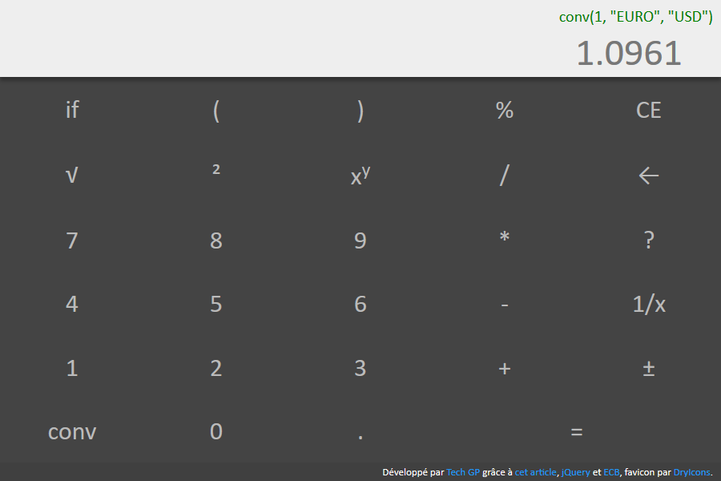
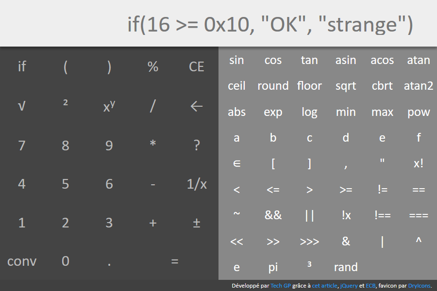

# webapps-calculator

A calculator application with usual mathematical features, extendable function support and unit conversion.

## Présentation

[Cette application](http://techgp.fr/webapps/webapps-calculator.html) écrite en HTML5, JavaScript et CSS3 vous donnera accès à une calculatrice directement dans votre navigateur.

Les liens suivants ont été utiles pour cette application :

- [Parsing Expressions by Recursive Descent](http://www.engr.mun.ca/~theo/Misc/exp_parsing.htm), un formidable article qui propose une méthode simple à implémenter pour créer un parseur... et qui a mené à l'écriture du parseur utilisé ici.
- [jsep](http://jsep.from.so/), pour JavaScript Expression Parser, sous licence MIT, qui été utilisé jusqu'au 22/05/2016 pour l'analyse des formules. L'API comme le code sont simples à comprendre.
- [jQuery 2.2.4](http://jquery.com/) sous licence MIT
- [ECB](http://www.ecb.europa.eu/stats/exchange/eurofxref/html/index.en.html) qui utilisé dans le convertisseur monétaire pour obtenir des taux de change quotidien

L'application peut être utilisée en mode déconnecté après une première utilisation. Le fichier manifest `webapps-calculator.appcache` décrit comme doit se faire la mise en cache. Plus d'info chez Mozilla [en français](https://developer.mozilla.org/fr/docs/Utiliser_Application_Cache) ou [en anglais](https://developer.mozilla.org/en-US/docs/Web/HTML/Using_the_application_cache).

NB : quand le certificat HTTPS est incorrect, la mise en cache échouera sous Chrome avec l'erreur `Manifest fetch Failed (9)`. Dans ce cas, faites les tests en HTTP et/ou utilisez un certificat valide en production.

## Captures d'écran

### Présentation de l'IHM

### Utilisation du convertisseur (monétaire par l'exemple)

### Accès aux fonctions avancées

## Liens autres

- [Conversion d'unités sur Wikipedia FR](https://fr.wikipedia.org/wiki/Conversion_des_unit%C3%A9s), qui a aidé à alimenter les unités utilisées par la fonction de conversion
- [Documentation de Math chez Mozilla](https://developer.mozilla.org/en-US/docs/Web/JavaScript/Reference/Global_Objects/Math), avec polyfill pour sinh, cosh, tanh, asinh, acosh, atanh, hypot, log2, log10, log1p, imul, clz32
- Recherche : http://stackoverflow.com/questions/1823612/lexer-written-in-javascript
- Recherche : http://stackoverflow.com/questions/1052470/javascript-parser-for-simple-expression
- Math.js, plus lourd que "jsep" et plus limité aux math : http://mathjs.org/download.html
- PEG.js; pour se construire des parseurs à partir de la syntaxe : http://pegjs.org/
- Tutoriel : [partie 1](http://ariya.ofilabs.com/2011/08/math-evaluator-in-javascript-part1.html), [partie 2](http://ariya.ofilabs.com/2011/08/math-evaluator-in-javascript-part-2.html) et [partie 3](http://ariya.ofilabs.com/2011/08/math-expression-evaluator-in-javascript-part-3.html)

## Licence

Ce projet est distribué sous licence MIT, reproduite dans le fichier LICENSE ici présent.

## Changelog

2016-04-25
- première version

2016-04-26
- function names and operators are case-insensitive
- press enter while input has focus to calculate
- reset success/error status when formula is cleared

2016-05-06
- correction de la precedence des opérateurs
- ajout du support multilingue, détecté par "navigator.language"
- ajout de la conversion d'unité, par exemple convert(2, "km", "m") = 1000
- ajout de la conversion monétaires, par exemple convert(2, "€", "$"), grâce à ECB
- ajout de l'opérateur "in" qui met en évidence le support des tableaux
- description math.js et PEG.js

2016-05-09
- ajout des rubriques "Accélération", "Force", "Pression", "Puissance", "Vitesse" et mise à jour de certaines autres rubriques
- renvoi vers la page Wikipedia des conversions en ne précisant que l'unité (par exemple convertir("radian"))
- ajout de noms secondaires pour les unités (par exemple masse atomique = dalton = Da = u = uma)
- intégration d'une [pull request](soney/jsep#23) pour personnaliser les "literals" (pi par exemple)
- intégration d'une [pull request](soney/jsep#27) pour corriger les opérateurs unaires
- intégration d'une [pull request](soney/jsep#17) pour permettre de saisir des nombres en héxa (0x12 par exemple)
- sur le même principe, permettre de saisir des nombres en binaire (0b1100 = 12 par exemple) ou en octal (0o12 = 10 par exemple)

2016-05-22
- mise à jour de jquery 2.2.2 en 2.2.4
- mettre en cache dans localStorage les taux de change (pour le mode déconnecté)

2016-05-29
- remplacement de [JSEP](http://jsep.from.so/) par un parseur fait maison, construit après lecture de l'article [Parsing Expressions by Recursive Descent](http://www.engr.mun.ca/~theo/Misc/exp_parsing.htm)

2016-05-30
- restaurer le support des chaines de caractères (cf Literal et next())
- corriger l'affichage du résultat si "false" (n'affiche rien pour le moment)
- terminer la traduction de "calculator.js" en anglais
- amélioration de "calculator.format" pour que les litéraux repenne la valeur saisie telle quelle

2016-06-04
- correction d'un bug sur l'évaluation de litéraux que Javascript assimile à faux (le nombre 0, le texte vide)
- homogénéisation du clavier de la calculatrice avec les opérateurs et fonctions du calculateur
- ajout de "1/x" (inverse), "e" (Euler's number), "³" (cubic), "cbrt" (cubic root), "!" (factorielle) et "atan2" (atan2(x, y) = atan(x/y))

2016-06-28
- ajout du fichier LICENCE

2016-06-30
- amélioration de la gestion des erreurs : traduction des messages et remontée de la position
- correction d'un bug pour ne pas planter lorsque localStorage n'est pas défini

2016-07-02
- laisser à l'utilisateur le choix de l'URL utilisée pour les taux de change

2017-05-01
- utilisation de Promise pour les calculs afin de permettre l'intégration de fonctions asynchrones, comme par exemple pour la conversion monétaire
- réorganisation du code pour la fonction de conversion, notamment pour la partie concernant les conversions monétaires
- suppression des liens vers Wikipédia (fonction obscure et en plus vers Wikipedia FR uniquement)

2017-05-04
- ajout du support des dates et/ou des heures (nécessite "moment.js")
- refactoring de l'interprétation des litéraux (suite à l'ajout des dates/heures)
- correction de la gestion des paramètres optionnels "undefined" dans "eval" et "evalAll"
- correction de la traduction des opérateurs car ce sont des mots réservés de la syntaxe

2017-05-06
- ajout du support des tableaux vides
- ajout du support des fonctions sans paramètre
- correction de la mise en cache cassée suite à l'ajout de "moment"
- mise à jour des screenshots

2017-05-08
- inversion de la déclaration des opérateurs dans "addDefaultOperators" pour éviter la valeur de "precedence" en dur
- correction de typo

2017-05-09
- suppression des Promise (introduites le 01/05) au profit de callback pour les 2 raisons suivantes :
1. les Promise ne sont pas supportées par IE
2. les Promise ne sont pas synchrones, même si tout le contenu de la formule est synchrone
- personnalisation possible des formats de dates et heures de Calculator via "dateFormat", "timeFormat" et "datetimeFormat"
- optimisation des opérateurs && et || pour s'arrêter dès que possible (un "false" pour && ou un "true" pour ||)

## TODO

- passer en ServiceWorker pour la gestion du cache plutôt que AppCache
- support de la notation 2.1e3 pour 2 * 10^3 
- vérification des paramètres pour les fonctions et les opérateurs
- support des variables + ajout des touches (++, --, =) et des opérateurs manquants (+= -= ...)
- ajout de +ror, +rol (operator décallage de bit avec rotation), présents dans la calculette windows
- saisie des angles en radian/degré/grade
- recherche ?
