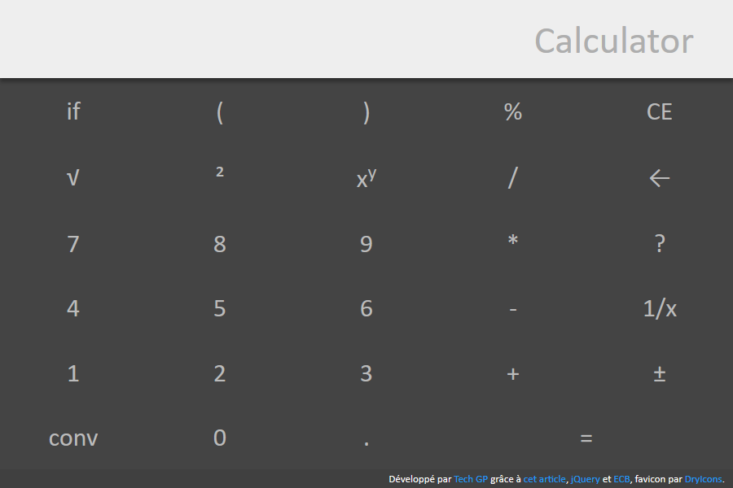

# webapps-calculator

A calculator application with usual mathematical features, extendable function support and unit conversion.

## Présentation

[Cette application](http://techgp.fr/webapps/webapps-calculator.html) écrite en HTML5, JavaScript et CSS3 vous donnera accès à une calculatrice directement dans votre navigateur.

Les librairies suivantes ont été utilisées pour cette application :

- [jsep 0.3.0](http://jsep.from.so/) sous licence MIT pour analyser les expressions demandées
- [jQuery 2.2.2](http://jquery.com/) sous licence MIT
- [ECB](http://www.ecb.europa.eu/stats/exchange/eurofxref/html/index.en.html) pour obtenir des taux de change quotidien

L'application est fournie avec un fichier manifest `webapps-calculator.appcache` permettant la mise en cache et l'utilisation en mode déconnecté. Plus d'info chez Mozilla [en français](https://developer.mozilla.org/fr/docs/Utiliser_Application_Cache) ou [en anglais](https://developer.mozilla.org/en-US/docs/Web/HTML/Using_the_application_cache).

NB : quand le certificat HTTPS est incorrect, la mise en cache échouera sous Chrome avec l'erreur `Manifest fetch Failed (9)`. Dans ce cas, faites les tests en HTTP et/ou utilisez un certificat valide en production.

## Captures d'écran

### Présentation de l'IHM

## Liens non retenus

- Recherche : http://stackoverflow.com/questions/1823612/lexer-written-in-javascript
- Recherche : http://stackoverflow.com/questions/1052470/javascript-parser-for-simple-expression
- Math.js, plus lourd que "jsep" et plus limité aux math : http://mathjs.org/download.html
- PEG.js; pour se construire des parseurs à partir de la syntaxe : http://pegjs.org/
- Tutoriel : [partie 1](http://ariya.ofilabs.com/2011/08/math-evaluator-in-javascript-part1.html), [partie 2](http://ariya.ofilabs.com/2011/08/math-evaluator-in-javascript-part-2.html) et [partie 3](http://ariya.ofilabs.com/2011/08/math-expression-evaluator-in-javascript-part-3.html)

## TODO

- saisie des angles en radian/degré/grade
- recherche ?
- voir aussi https://fr.wikipedia.org/wiki/Conversion_des_unit%C3%A9s
